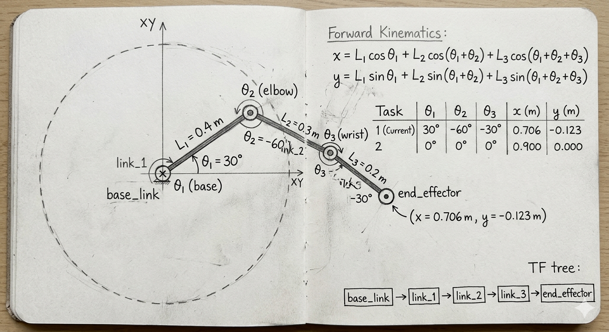
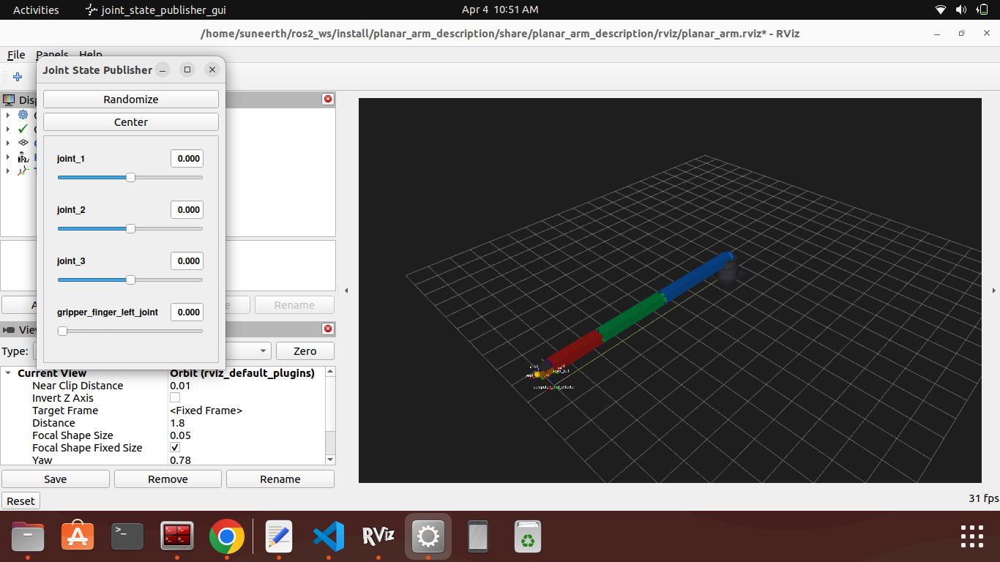
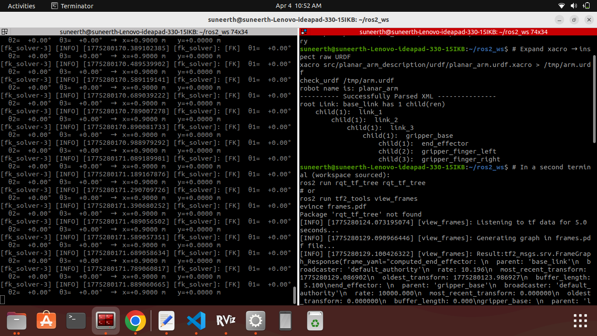
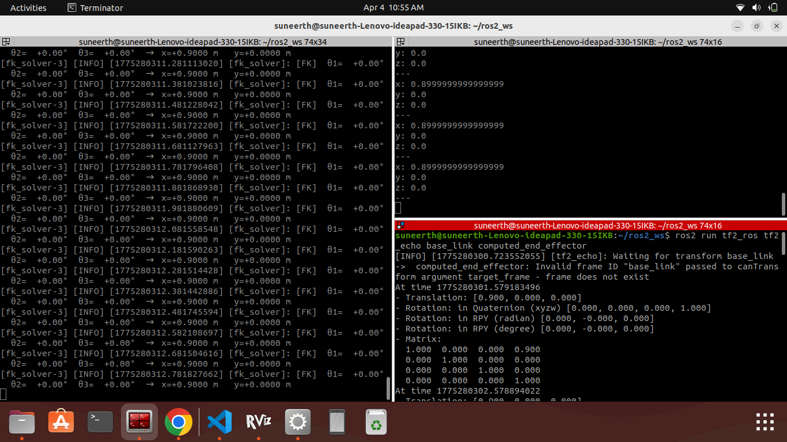
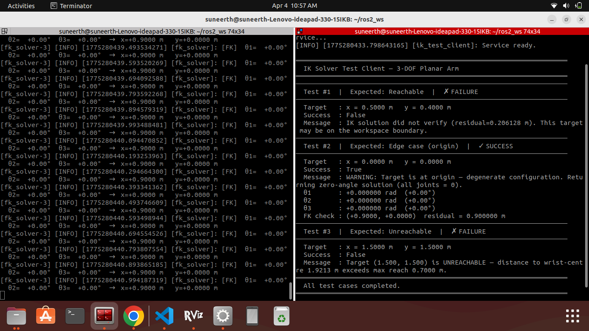

# 3-DOF Planar Robotic Arm — ROS 2 Workspace

**Candidate:** SUNKEERTH  
**Task:** ROS 2 Technical Task — 3-DOF Planar Robotic Arm  
**Environment:** ROS 2 Humble / Jazzy · Ubuntu 22.04 / 24.04 · Python 3

---

## Repository Structure

```
ros2_ws/
└── src/
    ├── planar_arm_description/        # Task 1 — URDF + launch
    │   ├── urdf/
    │   │   └── planar_arm.urdf.xacro  ← Xacro model
    │   ├── launch/
    │   │   └── display.launch.py      ← Launch file
    │   ├── rviz/
    │   │   └── planar_arm.rviz        ← RViz2 config
    │   ├── CMakeLists.txt
    │   └── package.xml
    │
    ├── planar_arm_interfaces/         # Custom service definition
    │   ├── srv/
    │   │   └── ComputeIK.srv
    │   ├── CMakeLists.txt
    │   └── package.xml
    │
    └── planar_arm_kinematics/         # Tasks 2 & 3 — FK / IK nodes
        ├── planar_arm_kinematics/
        │   ├── fk_solver.py           ← FK node (Task 2)
        │   ├── ik_solver.py           ← IK service server (Task 3)
        │   └── test_ik_client.py      ← IK test client (Task 3)
        ├── resource/
        ├── setup.py
        ├── setup.cfg
        └── package.xml
```

---
# 3-DOF Planar Robotic Arm — ROS 2 Workspace



## Prerequisites

```bash
# Install ROS 2 Humble (Ubuntu 22.04)
sudo apt update && sudo apt install -y \
  ros-humble-desktop \
  ros-humble-xacro \
  ros-humble-joint-state-publisher-gui \
  ros-humble-robot-state-publisher \
  ros-humble-tf2-ros \
  ros-humble-rviz2 \
  python3-colcon-common-extensions \
  python3-rosdep

# Source ROS 2
source /opt/ros/humble/setup.bash

# (For Jazzy replace 'humble' with 'jazzy' throughout)
```

---

## Build

```bash
# 1. Clone / enter workspace
cd ~/ros2_ws

# 2. Install dependencies
rosdep update
rosdep install --from-paths src --ignore-src -r -y

# 3. Build (interfaces first — kinematics depends on them)
colcon build --packages-select planar_arm_interfaces
colcon build --packages-select planar_arm_description planar_arm_kinematics

# 4. Source the install overlay
source install/setup.bash
```

> **Tip:** Run `source install/setup.bash` in every new terminal before using `ros2` commands from this workspace.

---
## Task 1 — URDF Modelling



)

## Task 1 — URDF Modelling

### Run

```bash
# Terminal 1 — launch everything (RSP + JSP GUI + FK + IK + RViz2)
source install/setup.bash
ros2 launch planar_arm_description display.launch.py

# Optional flags
ros2 launch planar_arm_description display.launch.py launch_rviz:=false
ros2 launch planar_arm_description display.launch.py launch_fk:=false launch_ik:=false use_sim_time:=false
```

### Verify URDF parses correctly

```bash
# Expand xacro → inspect raw URDF
xacro src/planar_arm_description/urdf/planar_arm.urdf.xacro > /tmp/arm.urdf
check_urdf /tmp/arm.urdf
```

Expected output:
```
robot name is: planar_arm
---------- Successfully Parsed XML ---------------
root Link: world has 1 child(ren)
    child(1):  base_link
        child(1):  link_1
            child(1):  link_2
                child(1):  link_3
                    child(1):  gripper_base
                        child(1):  end_effector
                        child(2):  gripper_finger_left
                        child(3):  gripper_finger_right
```

### View TF tree

```bash
# In a second terminal (workspace sourced):
ros2 run rqt_tf_tree rqt_tf_tree
# or
ros2 run tf2_tools view_frames
evince frames.pdf
```

---

## Task 2 — Forward Kinematics Node



## Task 2 — Forward Kinematics Node

### Run (standalone)

```bash
# Terminal 1
ros2 launch planar_arm_description display.launch.py launch_fk:=true launch_ik:=false

# Terminal 2 — monitor FK output
ros2 topic echo /end_effector_position

# Terminal 3 — monitor TF broadcast
ros2 run tf2_ros tf2_echo base_link computed_end_effector
```

### Expected output at all joints = 0°

```
[fk_solver]: [FK]  θ1=  +0.00°  θ2=  +0.00°  θ3=  +0.00°  →  x=+0.9000 m   y=+0.0000 m
```

Topic `/end_effector_position`:
```yaml
x: 0.9
y: 0.0
z: 0.0
```

### Verify FK math manually

| θ1 | θ2 | θ3 | x (expected) | y (expected) |
|----|----|----|-------------|-------------|
| 0° | 0° | 0° | 0.9000      | 0.0000      |
| 90°| 0° | 0° | 0.0000      | 0.9000      |
| 0° | 90°| 0° | 0.4000+0.0+0.2×cos(90°) = 0.4000 | 0.5000 |

---

## Task 3 — Inverse Kinematics Service

 

## Task 3 — Inverse Kinematics Service

### Run

```bash
# Terminal 1 — full stack
ros2 launch planar_arm_description display.launch.py

# Terminal 2 — run the test client
source install/setup.bash
ros2 run planar_arm_kinematics test_ik_client
```

### Expected test output

```
══════════════════════════════════════════════════════════════════════
  IK Solver Test Client — 3-DOF Planar Arm
══════════════════════════════════════════════════════════════════════
──────────────────────────────────────────────────────────────────────
  Test #1  |  Expected: Reachable  |  ✓ SUCCESS
──────────────────────────────────────────────────────────────────────
  Target   : x = 0.5000 m   y = 0.4000 m
  Success  : True
  θ1       : +0.927295 rad  (+53.13°)
  θ2       : -1.318116 rad  (-75.52°)
  θ3       : +0.000000 rad  (+0.00°)
  FK check : (+0.5000, +0.4000)  residual = 0.000000 m

──────────────────────────────────────────────────────────────────────
  Test #2  |  Expected: Edge case (origin)  |  ✓ SUCCESS
──────────────────────────────────────────────────────────────────────
  Target   : x = 0.0000 m   y = 0.0000 m
  Success  : True
  Message  : WARNING: Target is at origin ...
  θ1       : +0.000000 rad  (+0.00°)
  θ2       : +0.000000 rad  (+0.00°)
  θ3       : +0.000000 rad  (+0.00°)

──────────────────────────────────────────────────────────────────────
  Test #3  |  Expected: Unreachable  |  ✗ FAILURE
──────────────────────────────────────────────────────────────────────
  Target   : x = 1.5000 m   y = 1.5000 m
  Success  : False
  Message  : Target (1.500, 1.500) is UNREACHABLE — distance to
             wrist-centre 2.1213 m exceeds max reach 0.9000 m.
══════════════════════════════════════════════════════════════════════
```

### Call the service manually

```bash
# Ad-hoc service call
ros2 service call /compute_ik planar_arm_interfaces/srv/ComputeIK \
  "{target_x: 0.5, target_y: 0.4}"

ros2 service call /compute_ik planar_arm_interfaces/srv/ComputeIK \
  "{target_x: 1.5, target_y: 1.5}"
```

---

## Terminal Commands Quick Reference

```bash
# ── Build ───────────────────────────────────────────────────────────
cd ~/ros2_ws
source /opt/ros/humble/setup.bash
rosdep install --from-paths src --ignore-src -r -y
colcon build --packages-select planar_arm_interfaces
colcon build --packages-select planar_arm_description planar_arm_kinematics
source install/setup.bash

# ── Launch full stack ────────────────────────────────────────────────
ros2 launch planar_arm_description display.launch.py

# ── Individual nodes ─────────────────────────────────────────────────
ros2 run planar_arm_kinematics fk_solver
ros2 run planar_arm_kinematics ik_solver
ros2 run planar_arm_kinematics test_ik_client

# ── Inspection tools ─────────────────────────────────────────────────
ros2 topic list
ros2 topic echo /end_effector_position
ros2 topic echo /joint_states
ros2 service list
ros2 service type /compute_ik
ros2 run tf2_tools view_frames        # generates frames.pdf
ros2 run rqt_tf_tree rqt_tf_tree
rqt_graph                             # node / topic graph
```

---

## Conceptual Questions

### Q1 — Forward Kinematics vs Inverse Kinematics

**Forward Kinematics (FK)** computes the end-effector pose (position and orientation) given a known set of joint angles. It is a deterministic, closed-form calculation — for any joint configuration there is exactly one EE pose. **Inverse Kinematics (IK)** works in reverse: given a desired EE pose, it finds one or more joint-angle configurations that achieve it. IK is typically harder because solutions may be non-unique, may not exist (unreachable workspace), or may require iterative numerical methods for redundant arms.

In practice, a real robot uses **FK** for state estimation — after reading joint encoders it needs to know where its tool currently is. It uses **IK** for task-space control — when a pick-and-place trajectory specifies Cartesian waypoints, the motion planner converts each point into joint angles via IK before sending commands to the servo drivers.

### Q2 — Kinematic Singularities

A kinematic singularity is a configuration where the Jacobian (the matrix mapping joint velocities to EE velocities) becomes rank-deficient. At a singularity the arm loses the ability to move in one or more Cartesian directions, regardless of how fast joints spin — and inverse-Jacobian methods produce infinite or undefined joint velocities.

In this implementation, the geometric IK encounters a singularity when the arm is **fully extended** (cos θ2 = +1) or **fully folded** (cos θ2 = −1). These cases cause the `arctan2(k2, k1)` denominator to approach zero, making θ1 numerically ill-conditioned. I handle this with (1) a numerical clamp on the `acos` argument so it never exceeds ±1, (2) a near-singularity warning logged when `|cos θ2| > 1 − 1e-4`, and (3) a forward-verification step that rejects solutions with residual > 1 mm.

### Q3 — The ROS 2 TF System and the Computed Frame

The TF2 system maintains a time-stamped directed graph of coordinate frames. Every `TransformStamped` message that `fk_solver` broadcasts — placing `computed_end_effector` relative to `base_link` — is stored in TF's ring buffer. Any other node can then query TF for the transform between *any* two frames in the tree, even across indirect paths, by chaining the stored transforms. RViz2 uses the TF tree to render every link and sensor in a common reference frame.

A correct TF tree is critical because an inconsistent or broken chain (missing parent, stale timestamp, loop) prevents downstream nodes from resolving transforms, causing motion planners, collision checkers, and sensor fusion algorithms to fail silently or produce unsafe results on a real robot.

### Q4 — Differential-Drive Mobile Robot vs Robotic Arm Trajectory Planning

A differential-drive mobile robot operates in a **2-D configuration space** (x, y, heading θ) with **non-holonomic constraints** — it cannot move sideways instantly. Its motion planner (e.g. RRT, DWA) must respect these kinematic constraints and plan over a 2-D map, often using global path planners followed by local velocity controllers. Collisions are checked against a 2-D occupancy grid.

A robotic arm trajectory planner works in a high-dimensional **joint space** (one dimension per DOF). The arm is fully holonomic — each joint can be driven independently. Planning uses methods like OMPL (sampling-based) or MoveIt's CHOMP/STOMP (optimisation-based) in the full joint-angle space, and collision checking is performed against 3-D collision geometry in a scene. The output is typically a time-parameterised joint trajectory sent to a joint-trajectory controller, not velocity commands to wheels.

### Q5 — Extending to a 6-DOF Arm in 3-D Space

Moving from 3-DOF planar to 6-DOF spatial introduces several additional challenges:

1. **Redundancy and infinite solutions.** 6-DOF gives exactly as many degrees of freedom as needed for a full pose (3 position + 3 orientation), but different wrist configurations can achieve the same EE pose, creating multiple IK branches.
2. **Orientation constraints.** The IK must now solve for both position *and* a full 3-D orientation (roll, pitch, yaw), requiring decoupled or numerical methods such as the Pieper criterion (for spherical wrists) or iterative Jacobian-transpose / Levenberg–Marquardt solvers.
3. **Joint-coupling and complex workspaces.** 3-D elbow-up/down and shoulder-left/right configurations multiply the solution count (up to 16 analytical solutions for a standard 6-DOF arm), and the reachable workspace becomes a torus-like shell rather than a flat annulus.
4. **Singularity complexity.** Wrist singularities (wrist axes align), shoulder singularities, and elbow singularities all occur and must be individually detected and handled.
5. **Numerical robustness.** Closed-form analytic IK is only available for specific geometries (Pieper: three consecutive joint axes intersecting). General 6-DOF arms often require robust numerical solvers (e.g. KDL, TracIK, BioIK) with convergence guarantees.

---

*All the best. Built with correctness, clean code structure, and clear documentation in mind.*
